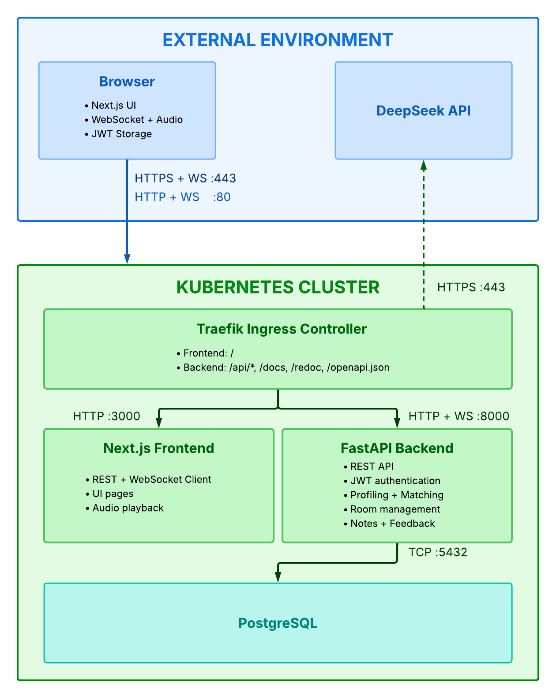
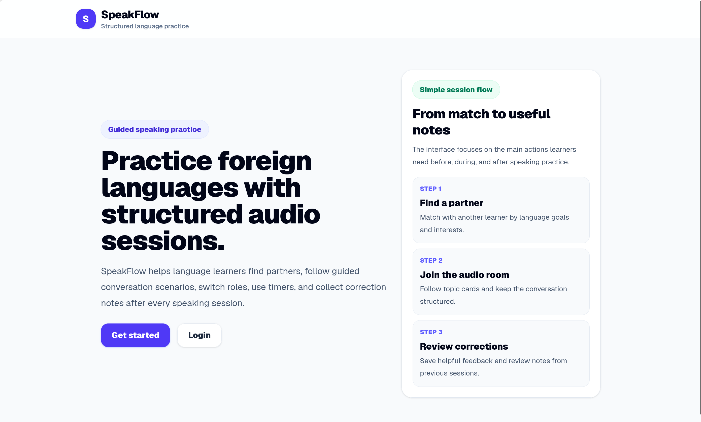
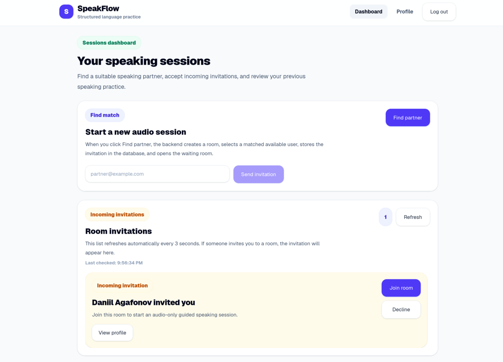
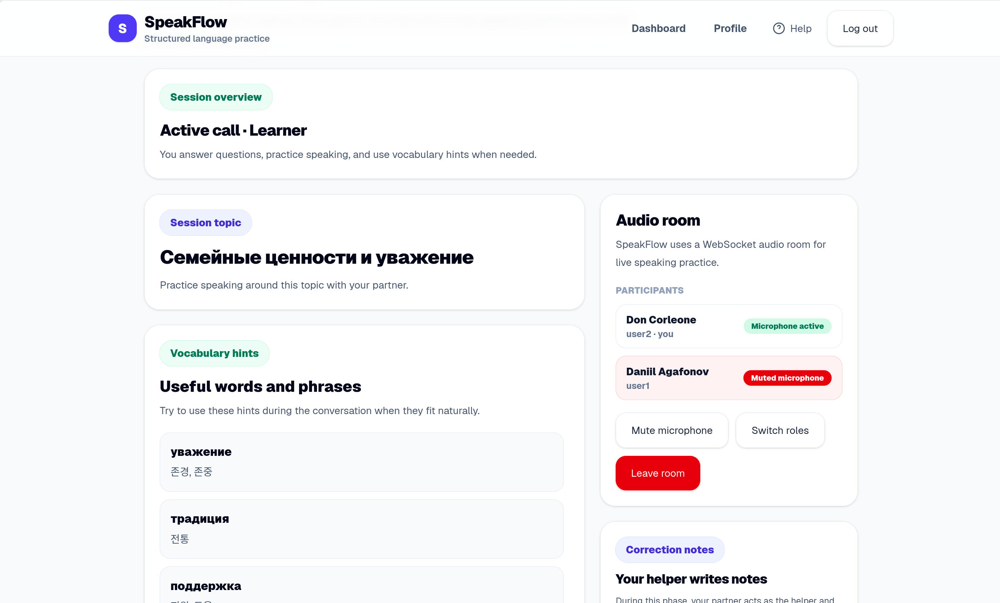

# SpeakFlow

A web platform for structured foreign language speaking practice between people from different parts of the world. Users create profiles with native and target languages and interests. The system matches suitable partners and allows them to join built-in audio-only rooms. During a session, users follow guided conversation scenarios with stages, roles, topic cards, useful phrases, correction notes and feedback. The main goal is to make language exchange more structured, balanced, and useful than regular chats or random calls.

## Roadmap

### Sprint 1

* JWT-based authentication
* Session topic templates
* Landing, Login, and Registration pages
* Initial database schema
* Containerization with Docker and orchestration with Docker Compose
* Kubernetes manifests for PostgreSQL and initial cluster setup
* Dataset synthesis

### Sprint 2

* Profile and Dashboard pages
* UI validation messages for the Login and Registration pages
* API endpoint for storing and retrieving live correction notes and session feedback
* Linting and build stages in the CI/CD pipeline
* Pipeline for transforming user bios and interests into vector embeddings
* Improved UI accessibility with larger fonts and buttons
* Kubernetes manifests for the backend, frontend, and Ingress
* Kubernetes-based orchestration

### Sprint 3

* API endpoints for user invitations
* LLM-generated vocabulary hints
* UI for vocabulary hints
* API endpoint for user matching
* Comprehensive API testing with Pytest in the CI/CD pipeline
* Continuous deployment

### Sprint 4

* Support for direct invitations
* Role-switching mechanism
* UI for live correction notes and post-session feedback
* UI for viewing a partner's profile
* UI simplification and usability improvements

### Sprint 5

* Comprehensive documentation in `README.md` and an installation script
* Automatic fallback to predefined session topics when no DeepSeek API key is provided
* Code coverage reporting and report generation script
* Enforcement of a single active session per user
* DeepSeek-powered smart matching
* User tutorial

## Features

- User registration and JWT authentication
- User profile with native/target languages and interests
- Partner matching for language exchange
- Audio-only conversation rooms
- AI-generated conversation session templates
- Live correction notes during conversations
- Session feedback system
- REST API with OpenAPI (Swagger)
- Docker Compose support for local development
- Kubernetes deployment

## Team Contributions

- **Denis Nurmuhametov** (Backend, Project Manager): authentication & authorization, project management
- **Alina Pestova** (Machine Learning): partner matching engine
- **Semen Nadutkin** (DevOps): infrastructure, Docker, Kubernetes, CI/CD and deployment
- **Igor Baranov** (Backend): audio rooms and real-time communication
- **Damir Bayazitov** (Frontend): frontend implementation and application pages
- **Daniil Agafonov** (Frontend): UI/UX design and interface development
- **Magomedgadzhi Ibragimov** (Backend): AI-powered session generation, live notes and feedback system

## Architecture



## Tech Stack

### Backend
- **FastAPI** — REST API
- **SQLAlchemy 2.0** (async) + **asyncpg** — database
- **PostgreSQL** — database
- **JWT** (`python-jose`) — access + refresh token auth
- **passlib[bcrypt]** — password hashing
- **pytest** + **pytest-asyncio** + **httpx** — testing
- **Ruff** — code linting

### Frontend
- **Next.js** — React framework
- **TypeScript** — type safety
- **Tailwind CSS** — styling

### Infrastructure
- **Docker** — containerization
- **Kubernetes** — orchestration
- **Kubeseal** — secrets management
- **GitLab CI** — automation

## Environment Variables (.env)

| Variable | Description |
|----------|-------------|
| `POSTGRES_DB` | Database name |
| `POSTGRES_USER` | Database user |
| `POSTGRES_PASSWORD` | Database password |
| `JWT_SECRET_KEY` | JWT signing key |
| `JWT_ALGORITHM` | JWT algorithm |
| `JWT_ACCESS_TOKEN_EXPIRE_MINUTES` | Access token lifetime (minutes) |
| `JWT_REFRESH_TOKEN_EXPIRE_DAYS` | Refresh token lifetime (days) |
| `DEEPSEEK_API_KEY` | Access key to DeepSeek API  |

## Run Locally with Docker Compose

### Prerequisites

- Docker and Docker Compose
- A DeepSeek API key (see the [setup instructions](https://platform.deepseek.com/api_keys))

### Installation

1. Clone the repository:

    ```bash
    git clone https://gitlab.pg.innopolis.university/speakflow/speakflow.git
    cd speakflow
    ```

2. Build and start the application:

    ```bash
    bash scripts/install-docker-compose.sh
    ```

3. Once the containers are running, the following services will be available:

| Service | URL |
|---------|-----|
| Backend API | `http://localhost:8000` |
| Swagger UI | `http://localhost:8000/docs` |
| ReDoc | `http://localhost:8000/redoc` |
| Web Application | `http://localhost:3000` |

## Deployed Application

| Service       | URL |
|---------------|-----|
| Backend       | `https://10.93.27.41` |
| Swagger UI    | `https://10.93.27.41/docs` |
| ReDoc         | `https://10.93.27.41/redoc` |
| Main app (UI) | `https://10.93.27.41/` |

## Figures

### UI/UX Design

A dedicated UI/UX design phase and Figma mockups were intentionally omitted in this project. The primary focus was on backend development, system architecture, API design, and server-side functionality. Since the frontend was not the core objective, the user interface was developed iteratively alongside implementation. This approach enabled the team to rapidly validate ideas, adapt the interface to evolving requirements, and prioritize the project's core technical objectives. As a result, no Figma design files were created.

### Landing page



### Dashboard



### Session page



## Testing

### Linux/MacOS

- **Prerequisites:** Docker

```bash
# Build & Run with Docker Compose
bash ./install.sh

# Run the tests
docker run --rm \
    --network speakflow_default \
    semyonnadutkin/speakflow-tests:latest -d
```

## Code Coverage

- **Code Coverage:** 70.44%
- Generate code coverage report with the provided script:
```bash
bash scripts/code-coverage.sh
```

## Backend API Endpoints

| Method | Path                                      | Description                    |
| ------ | ----------------------------------------- | ------------------------------ |
| POST   | `/api/v1/auth/register`                   | Register                       |
| POST   | `/api/v1/auth/login`                      | Login                          |
| POST   | `/api/v1/auth/refresh`                    | Refresh tokens                 |
| GET    | `/api/v1/users/me`                        | Current user profile           |
| PATCH  | `/api/v1/users/me`                        | Update profile                 |
| DELETE | `/api/v1/users/me`                        | Delete account                 |
| GET    | `/api/v1/users/match`                     | Find conversation partners     |
| GET    | `/api/v1/audio/active-room`               | Get active audio room          |
| POST   | `/api/v1/audio/create-room`               | Create audio room              |
| POST   | `/api/v1/audio/invite-by-email`           | Invite user to a room by email |
| GET    | `/api/v1/audio/pending-invitations`       | Get pending room invitations   |
| POST   | `/api/v1/audio/join-room`                 | Join audio room                |
| POST   | `/api/v1/audio/leave-room`                | Leave audio room               |
| POST   | `/api/v1/audio/decline-invitation`        | Decline room invitation        |
| GET    | `/api/v1/session-templates`               | List session templates         |
| GET    | `/api/v1/session-templates/{template_id}` | Get session template           |
| POST   | `/api/v1/session-templates/generate`      | Generate session template      |
| POST   | `/api/v1/notes/create`                    | Create live correction note    |
| GET    | `/api/v1/notes`                           | List notes                     |
| GET    | `/api/v1/notes/rooms/{room_id}/mine`      | Get user's notes for a room    |
| POST   | `/api/v1/feedback/create`                 | Submit session feedback        |
| GET    | `/api/v1/feedback`                        | List feedback                  |
